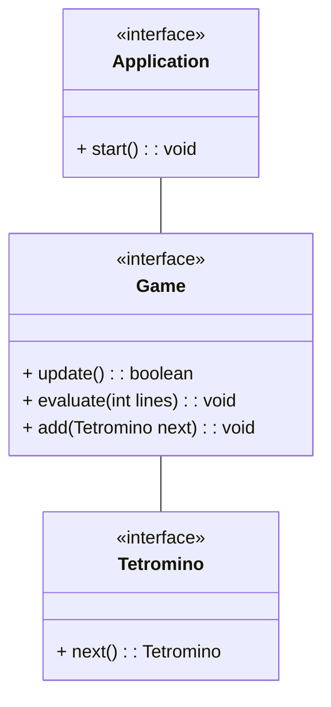
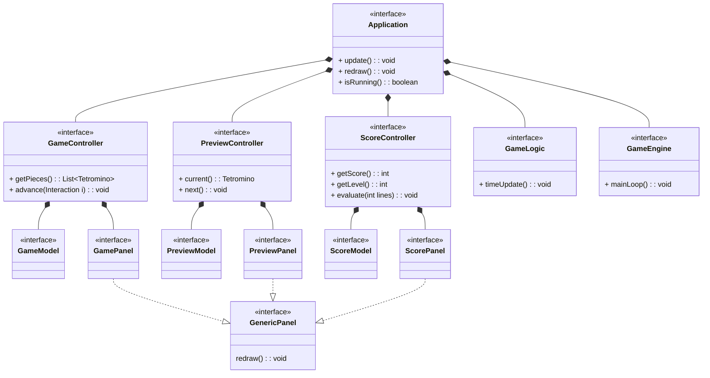
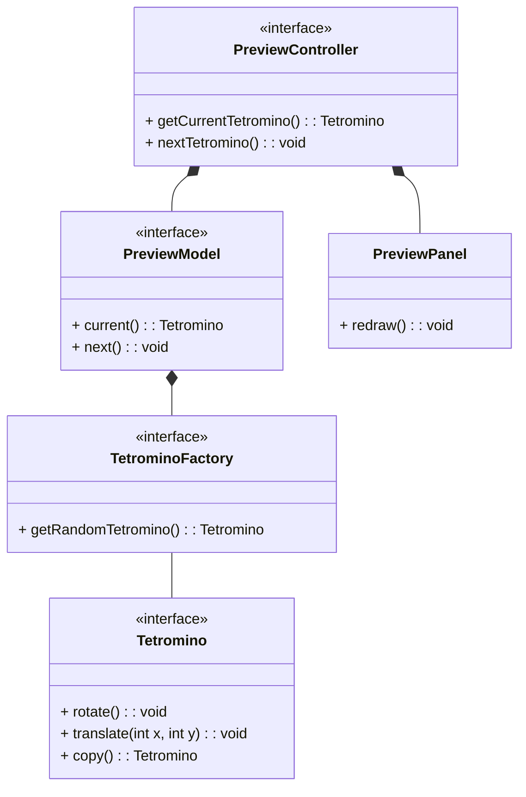
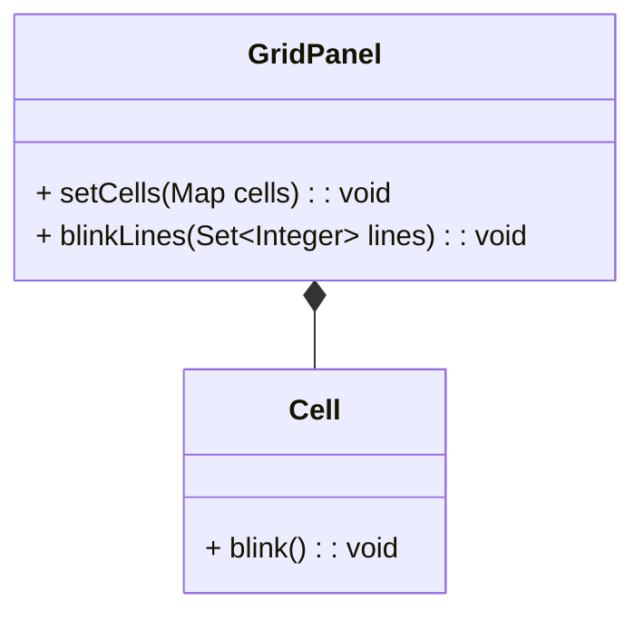
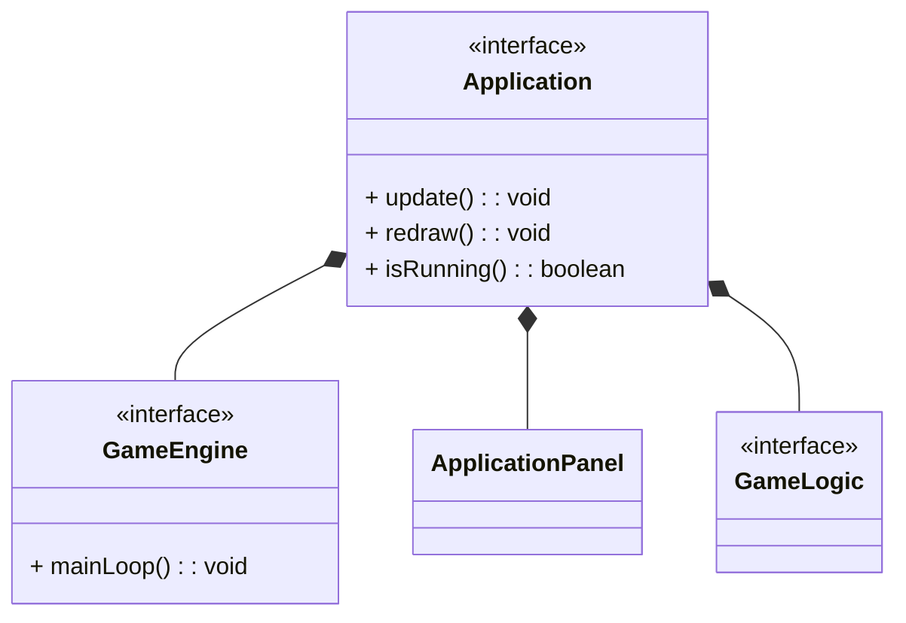
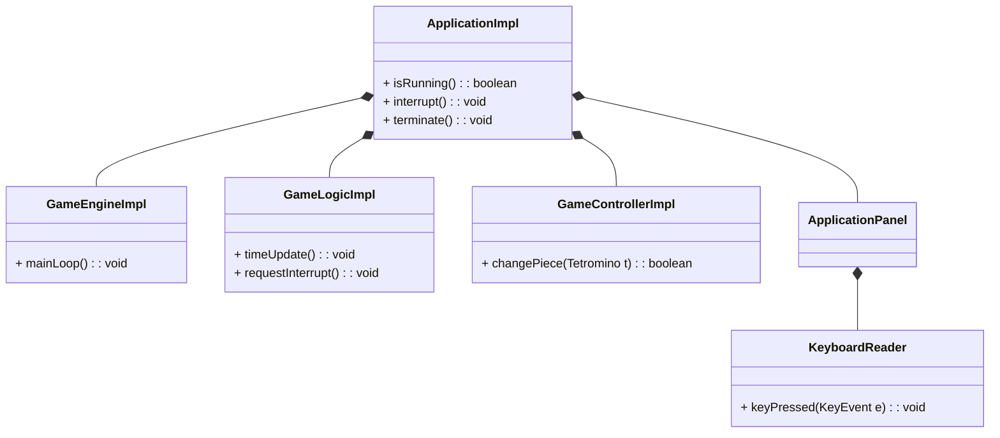
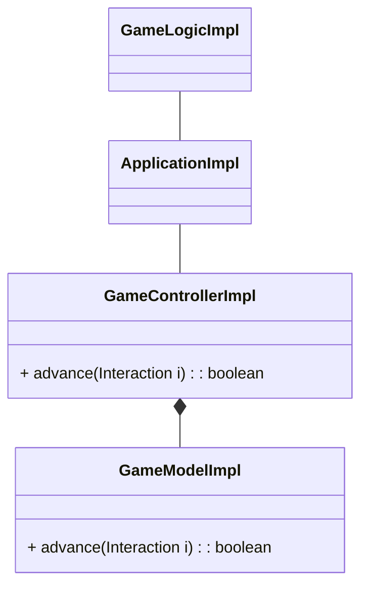
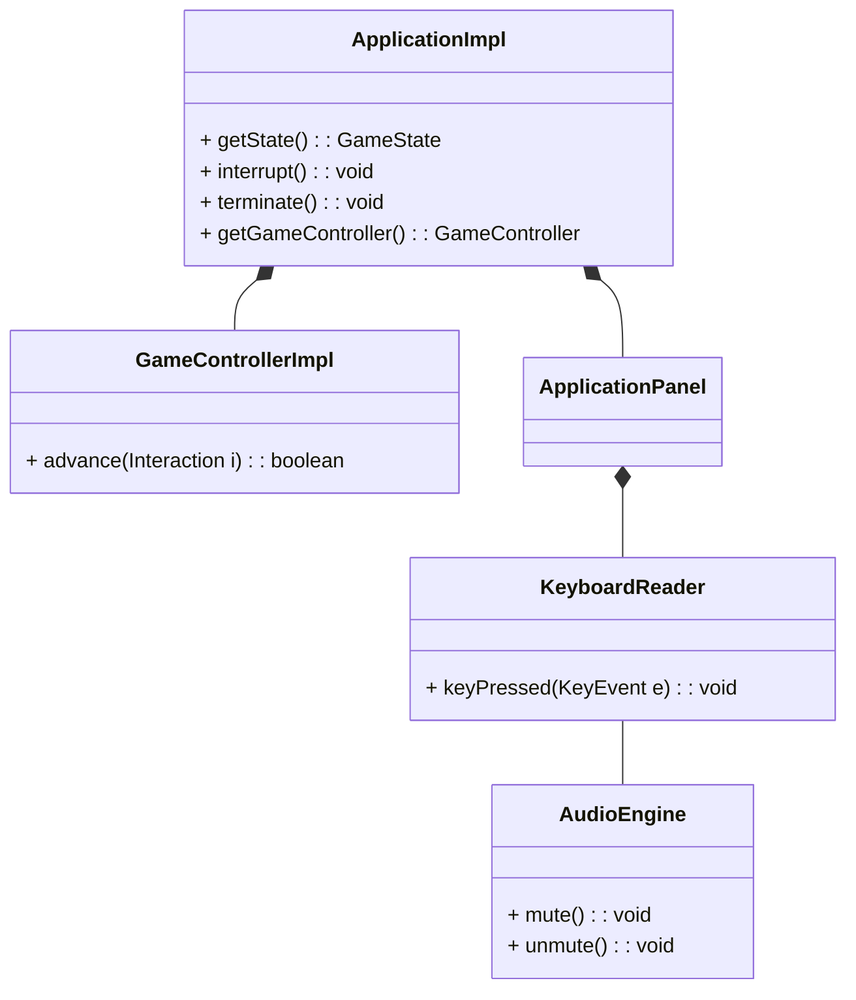
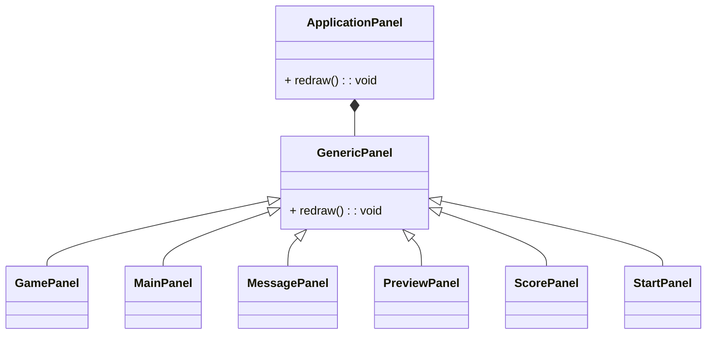

# jTetris

Relazione per il progetto del corso di Programmazione a Oggetti

- Antonio Emanuele Pepe
- Alex Giamperoli

29-09-2023

## Indice

1. [Analisi](#capitolo-1---analisi")
    - 1.1 [Requisiti](#11-requisiti)
    - 1.2 [Analisi e modello del dominio](#12-analisi-e-modello-del-dominio)
2. [Design](#capitolo-2---design)
    - 2.1 [Architettura](#21-architettura)
    - 2.2 [Design dettagliato](#22-design-dettagliato)
3. [Sviluppo](#capitolo-3---sviluppo)
    - 3.1 [Testing automatizzato](#31-testing-automatizzato)
    - 3.2 [Metodologia di lavoro](#32-metodologia-di-lavoro)
    - 3.3 [Note di sviluppo](#33-note-di-sviluppo)
4. [Commenti finali](#capitolo-4---commenti-finali)
    - 4.1 [Autovalutazione e lavori futuri](#41-autovalutazione-e-lavori-futuri)
+ Appendice A - [Guida utente](#appendice-a---guida-utente)

## Capitolo 1 - Analisi

### 1.1 Requisiti

Il presente progetto si pone come obiettivo quello di creare un videogioco in grafica 2D che prende ispirazione dal famoso gioco "Tetris", cogliendone gli aspetti della modalità _survival_.

#### Requisiti funzionali

- L'applicativo dovrà gestire una partita single-player e presentarla all'utente mediante un'interfaccia grafica. Lo stesso utente interagirà con essa attraverso l'uso della tastiera.

- L'utente avrà come fine ultimo quello di totalizzare il maggior numero di punti. Questo è reso possibile eliminando da una a quattro righe del campo di gioco. Una riga si ritiene completa ed eliminabile quando ogni sua cella contiene esattamente una parte di un Tetramino.

- Il gioco deve seguire un modello incrementale di difficoltà. Ogni 10 righe completate verrà incrementato di un'unità il livello. Livelli maggiori comportano che un Tetramino cada più velocemente verso il basso.

- L'applicativo deve permettere all'utente un meccanismo di pausa e ripresa dalla partita, così come presentare una schermata iniziale e di termine della stessa.

#### Requisiti non funzionali

- L'interfaccia dovrà presentarsi quanto più intuibile e simile al gioco originale. Questo permetterà all'utente di usufruirne conoscendo pochi semplici comandi.

- Il gioco dovrà operare in maniera responsiva relativamente alle interazioni con l'utente.

- Il codice deve rimanere quanto più inalterato possibile qualora si preveda di inserire la gestione di più utenti (profili) o l'aggiunta di nuove modalità.

### 1.2 Analisi e modello del dominio

L'utente che si interfaccia con l'applicazione è in grado di ricavare le informazioni di gioco (prossimo pezzo, punteggio, livello, ecc.) e muovere il Tetramino attualmente in caduta.

I Tetramini, componenti essenziali del gioco e di sette forme differenti, sono estratti in maniera casuale. Uno stesso Tetramino non può essere estratto se prima non sono stati estratti tutti quelli di forme differenti alla sua.

Ogni Tetramino cade dalla sommità della griglia e può essere mosso e/o ruotato di 90° (orari) a condizione che questa operazione sia compatibile con lo spazio rimanente all'interno della griglia. Arrivato in fondo o toccato un altro Tetramino sotto di esso, questo termina di cadere e viene immesso il pezzo successivo.

## Capitolo 2 - Design

### 2.1 Architettura

Per lo sviluppo di questo progetto è stato scelto il pattern architetturale MVC (Model-View-Controller) in modo tale da poter suddividere ciò che viene presentato all'utente dalla base da cui questa vista viene derivata. Questo permetterebbe, in implementazioni future, di poter apportare modifiche alla grafica senza intaccare la parte di modello (ed eventualmente il viceversa).

Nello specifico si è deciso di adottare questo pattern per le tre componenti che vanno a costituire ciò che l'utente finale andrà ad apprezzare dell'applicativo: la griglia di gioco, la finestra di preview e l'informativa con i dati di gioco. Ognuna di queste potrà interagire con le altre mediante i propri controller e questo rende possibile una gestione più fine dei dati interscambiati.

L'insieme delle view verrà incorporato in un'unica finestra così che vengano presentate all'utente le tre viste contemporaneamente, in modo da rispettare il look-and-feel del gioco originale. Per fare questo è necessario un altro controller che permetta di gestire la logica di gioco vera e propria: le azioni da svolgere quando una linea viene completata, i punteggi da assegnare, la generazione dei nuovi pezzi, ecc...

Data la forte natura event-driven del dominio, l'intero applicativo sarà supportato da un gameloop (gestito da un apposito motore di gioco) che andrà a scandire lo scorrere del tempo e permettere l'esecuzione delle azioni volute dall'utente.

### 2.2 Design dettagliato

#### 2.2.1 Antonio Emanuele Pepe

#### Entrata di un Tetramino in gioco

**Problema:** Durante lo svolgimento di una partita, l'utente si aspetta di ritrovare nella finestra di preview il Tetramino successivo che verrà poi messo in gioco.

**Soluzione:** Data l'interazione tra i vari controller, ho ritenuto opportuno che il controller che si occupa della preview metta a disposizione solamente un modo per sapere quale sia il pezzo correntemente visualizzato e un modo per passare a quello successivo. La model relativa, ricorrerà a una factory di Tetramini che è in grado di generarli secondo le regole di gioco. Questo meccanismo, che ricorda il passaggio della staffetta, permette al `GameController` di ottenere sempre il pezzo corretto da inserire in gioco. Dal momento che il Tetramino fornito verrà passato con il suo riferimento, eventuali operazioni su di esso (verifiche del bound, ecc.) potrebbero modificarlo inevitabilmente. Per facilitare queste verifiche, ho predisposto la possibilità di copiare un Tetramino.

#### Visualizzazione dei Tetramini

**Problema:** Il gioco deve avere un sistema in grado di visualizzare i vari Tetramini nello spazio 2D, indipendentemente dal loro numero e dalla loro forma.

**Soluzione:** Ho ritenuto utile considerare i Tetramini disposti su una griglia di dimensione `N` &times; `M` e avere a disposizione un sistema che li visualizzi a partire da una loro collezione. Questa griglia si compone di celle indipendenti in grado di assumere uno stato (colore) diverso, a seconda delle necessità. Durante lo sviluppo mi sono reso conto di dover permettere alle linee di una griglia di poter lampeggiare per poter dare un feedback visivo riguardo il completamento di una linea. Tale funzionalità è resa possibile permettendo questo effetto a una singola cella e, conseguentemente, considerando ogni linea di `GridPanel`.

#### Gestione del gameloop

**Problema:** Il gioco è fortemente basato sullo scorrere del tempo e sulla lettura degli eventi (tastiera). I cambiamenti allo stato di gioco che ne conseguono devono essere applicati in maniera repentina per fornire una buona esperienza all'utente.

**Soluzione:** Ho ritenuto opportuno creare un componente separato dall'applicazione principale (`Application`), in modo che possa gestire in autonomia il gameloop e permetterne qualsivoglia cambiamento. Questo ha portato alla creazione dell'interfaccia `GameEngine`. Tale interfaccia, nella sua implementazione prevede di avere un riferimento all'applicazione da prendere in carico così che possa gestire il processo di redraw e aggiornamento della logica di gioco quando necessario.

#### 2.2.2 Alex Giamperoli

#### Stato di gioco

**Problema:** Il gioco può trovarsi in diversi stati in base agli avvenimenti accaduti, da gestire correttamente.

**Soluzione:** Il gameloop termina solo quando viene fatta richiesta da parte dell'utente (pressione del tasto ESC). La logica di gioco si occupa invece di gestire lo stato dello stesso in base agli avvenimenti accaduti (pressione del tasto SPACE o impossibilità nell'inserire un nuovo pezzo nella griglia di gioco).

*Si omette in questo diagramma la gestione dell'audio dato che si comporta in maniera molto simile alla richiesta di pausa.*

#### Gestione dei movimenti

**Problema:** Il gioco deve assicurare che ogni movimento del pezzo in caduta (rotazione e traslazione) sia sempre coerente con le regole di gioco.

**Soluzione:** All'interno del `GameModel` vengono memorizzati i pezzi attualmente posizionati nella griglia e le dimensioni della stessa in modo da poter calcolare se la nuova posizione del pezzo e/o la sua possibile rotazione siano valide. Ogni esito di questo cambiamento deve essere trasmesso alla logica affinché vengano applicate le giuste regole di gioco.

#### Keyboard listener

**Problema:** Durante l'avanzamento del gameloop, l'utente deve poter interagire con il gioco attraverso la tastiera per spostare a piacimento il Tetramino corrente e/o mettere in pausa il gioco e la musica, senza però dover aspettare la terminazione dei singoli cicli del gameloop stesso.

**Soluzione:** Per ottenere una maggior reattività del gioco agli input che esso riceve, si è deciso di effettuare le azioni richieste contestualmente alla pressione dei tasti, il tutto in relazione allo stato corrente del gioco.

#### 2.2.3 Sezione condivisa

Lo sviluppo grafico, di cui alcune scelte di design sono contenute in questa sezione, è stato svolto per lo più in cooperazione. Questo ha permesso di avere una base comune su cui orientarci per poter arrivare all'applicativo finito.

#### Struttura della grafica di gioco

**Problema:** Durante lo svolgimento del gioco sono necessarie più e diverse viste che siano intercambiabili all'occorrenza, sulla base delle interazioni con l'utente (inizio, sconfitta, pausa, ecc.).

**Soluzione:** Abbiamo ritenuto utile considerare ogni componente grafico che presenti un'informazione unica come a sé stante. Alla luce di ciò ogni pannello (griglia di gioco, anteprima del prossimo Tetramino, punteggio, schermata iniziale, ecc.) sono stati considerati come pannelli generici (`GenericPanel`) in grado di avere la possibilità di essere ridisegnati. Ogni pannello implementerà una funzione `redraw` in base alla sua semantica. `ApplicationPanel`, il pannello principale che contiene tutta la grafica di gioco, sarà in grado di ridisegnare ognuna delle sue componenti senza preoccuparsi degli aspetti implementativi.

## Capitolo 3 - Sviluppo

### 3.1 Testing automatizzato

Per quanto riguarda la verifica del corretto funzionamento della logica di gioco, si è fatto ricorso a quanto messo a disposizione da JUnit 5. Sono stati predisposti una serie di test mirati principalmente alla parte del modello, dal momento che la geometria di gioco e l'eventuale assegnamento dei punteggi è fondamentale per ottenere la miglior esperienza utente possibile.

In particolare, si sono realizzati i seguenti test:
- `TetrominoTest`: verifica la corretta traslazione, rotazione ed eliminazione di un Tetramino.
- `TetrominoFactory`: verifica che la sequenza di Tetramini generata rispetti le regole del gioco.
- `ScoreModelTest`: verifica il corretto assegnamento del punteggio, tenendo conto anche del livello di gioco.
- `GameModelTest`: verifica che ogni Tetramino presente nella griglia si muova e ruoti senza collidere con gli altri Tetramini, non esca dai vincoli dimensionali. Sono inoltre verificate le eliminazioni di una o più linee.

### 3.2 Metodologia di lavoro

Nella prima fase di sviluppo del progetto si è scelto di decidere come utilizzare gli strumenti a disposizione, suddividere i vari compiti e quali parti dello stesso assegnare ad ogni membro. Queste suddivisioni sono state fatte in modo da distribuire in maniera equa il carico di lavoro che sarebbe poi stato svolto.

Inizialmente la scelta è ricaduta sulla metodologia di utilizzo del DVCS. Ogni componente ha lavorato su un branch di sviluppo personale a cui verranno aggiunti i cambiamenti dell'altro qualora ve ne fossero. Questo ha permesso di poter ritornare sui propri passi qualora si fosse arrivati a un non funzionamento dell'applicativo.
Nel momento in cui si sia prodotto un software (parzialmente) funzionante, questi sarebbero stati aggiunti al branch di sviluppo principale.

Alla luce di questa fase di pianificazione si è suddiviso il lavoro individuale come segue:
- **Antonio Emanuele Pepe**: gestione della parte di preview (`PreviewController`, `PreviewModel`, `PreviewPanel`),
dei Tetramini e loro generazione (`Tetromino`, `TetrominoFactory`), dell'engine di gioco (`GameEngine`), dell'audio e caricamento delle risorse (`AudioEngine`, `ResourceLoader`) e della griglia (`GridPanel`).
- **Alex Giamperoli**: gestione della parte di game model (`GameController`, `GameModel`, `GamePanel`), dei punteggi (`ScoreController`, `ScoreModel`, `ScorePanel`), della logica di gioco (`GameLogic`) e struttura dell'applicazione (`Application`).

Aspetti inerenti all'input da tastiera (`KeyboardReader`) e tutto quello inerente alla maggior parte della GUI sono stati svolte in comune per lo più in collaborazione, per avere una coscienza comune riguardo il sistema su cui avrebbe preso vita l'applicazione.

#### Antonio Emanuele Pepe

In autonomia mi sono occupato di:
- Sviluppo del modello ed implementazione MVC per quanto riguarda la preview di un Tetramino.
- Creazione ed implementazione del concetto di Tetramino come entità in grado di ruotare, eseguire traslazioni e subire modifiche a seguito del completamento delle linee.
- Sviluppo di una factory di Tetromini che segua l'estrazione casuale secondo le regole di gioco
- Scorporamento dell'engine di gioco dall'applicazione.
- Implementazione di feature decorative come l'audio di gioco e caricamento delle risorse.
- Sviluppo della parte inerente alla visualizzazione dei Tetramini.

In collaborazione mi sono occupato di:
- Ideare il sistema di lettura degli eventi da tastiera per assegnarlo come listener ad `ApplicationPanel`.

#### Alex Giamperoli

In autonomia mi sono occupato di:
- Sviluppo ed implementazione del modello MVC per quanto riguarda il modello principale del gioco.
- Sviluppo ed implementazione del modello MVC per quanto riguarda l'assegnamento dei punteggi.
- Creazione della struttura dell'applicazione principale.
- Implementazione della logica di gioco e dei suoi stati.

In collaborazione mi sono occupato di:
- Integrare la lettura della tastiera in `KeyboardReader` con l'applicazione principale.

#### Collaborazione

- Creazione della struttura grafica principale (`ApplicationFrame → ApplicationPanel → List<GenericPanel>`) e meccanismi di ridisegno.
- Implementazione del sistema multy-layer per permettere lo scambio dei vari pannelli.
- Implementazione dei singoli pannelli (escluse le view dei tre controller sopra citati).

### 3.3 Note di sviluppo

#### Antonio Emanuele Pepe

- Utilizzo di Stream e IntStream per la gestione delle coordinate di un Tetramino. Seguono alcuni esempi:

https://github.com/Sonofapo/OOP22-jtrs/blob/2aeff6f68fed1508f020c7ed595d120fd78431c9/src/main/java/it/unibo/jtrs/model/impl/TetrominoImpl.java#L46

https://github.com/Sonofapo/OOP22-jtrs/blob/2aeff6f68fed1508f020c7ed595d120fd78431c9/src/main/java/it/unibo/jtrs/model/impl/TetrominoImpl.java#L87

- Utilizzo di Lambda Expression. Seguono alcuni esempi:

https://github.com/Sonofapo/OOP22-jtrs/blob/2aeff6f68fed1508f020c7ed595d120fd78431c9/src/main/java/it/unibo/jtrs/view/custom/GridPanel.java#L71

https://github.com/Sonofapo/OOP22-jtrs/blob/6994d9f924221a868cafcf976f49365daeab2ea8/src/main/java/it/unibo/jtrs/view/custom/GridPanel.java#L83

#### Alex Giamperoli

- Utilizzo di Stream e IntStream. Seguono alcuni esempi:

https://github.com/Sonofapo/OOP22-jtrs/blob/2aeff6f68fed1508f020c7ed595d120fd78431c9/src/main/java/it/unibo/jtrs/model/impl/GameModelImpl.java#L107

https://github.com/Sonofapo/OOP22-jtrs/blob/2aeff6f68fed1508f020c7ed595d120fd78431c9/src/main/java/it/unibo/jtrs/model/impl/GameModelImpl.java#L148

- Utilizzo di Lamba Expression. Segue un esempio:

https://github.com/Sonofapo/OOP22-jtrs/blob/328a8a496976ecebf2dc8167c66bf630786ccb72/src/main/java/it/unibo/jtrs/model/impl/GameModelImpl.java#L143

- Utilizzo di Predicate e Consumer. Seguono alcuni esempi:

https://github.com/Sonofapo/OOP22-jtrs/blob/328a8a496976ecebf2dc8167c66bf630786ccb72/src/main/java/it/unibo/jtrs/model/impl/GameModelImpl.java#L100

https://github.com/Sonofapo/OOP22-jtrs/blob/328a8a496976ecebf2dc8167c66bf630786ccb72/src/main/java/it/unibo/jtrs/model/impl/GameModelImpl.java#L101

Link a risorse esterne utilizzate:
- Immagine di sfondo: https://wallpapercave.com/wp/wp4478566.jpg
- Traccia audio: https://archive.org/details/TetrisThemeMusic

Altri elementi esterni utilizzati:
- Classe di Pair generici, fornita dal corso di OOP

## Capitolo 4 - Commenti finali

### 4.1 Autovalutazione e lavori futuri

#### Antonio Emanuele Pepe

Nonostante la mia personale propensione a prediligere maggiormente il lavoro individuale rispetto a quello di gruppo, ho cercato sin dall'inizio di mettermi in gioco per la creazione di un software sviluppato in cooperazione. Alla luce di ciò, mi ritengo soddisfatto del risultato finale. Elementi come il rispetto di una deadline, la produzione di codice quanto più di qualità possibile e che debba essere condiviso con altre persone, mi ha dato lo stimolo per rispettare tali condizioni. Questo lavoro, inoltre, mi ha permesso di dare un importante peso alla scelta di convenzioni comuni e stili da rispettare, al fine di procedere nello sviluppo più celermente e con il minor numero di *imprevisti*. Formativo è stato anche il dover suddividere il lavoro in maniera che sia il più indipendente possibile da quello dell'altro ma che, qualora fosse necessario, la sua integrazione risultasse lineare. Intravedo la possibilità di ulteriori miglioramenti sia dal punto di vista della qualità del software e progettazione sia dal punto di vista delle funzionalità aggiuntive che potranno essere implementate approfondendo maggiormente quello che il linguaggio mette a disposizione.

#### Alex Giamperoli

Credo che questo progetto mi abbia dato la possibilità di crescere come sviluppatore software, in quanto mi ha fatto capire l'importanza di pensare e progettare la struttura del sistema complessivo sin da subito. La fase di progettazione è stata quella che mi è rimasta più ostica, anche perché è da svolgersi in gruppo e non singolarmente; questo crea scambi di idee molto spesso differenti, ma porta a migliori soluzioni. Una volta passata questa prima fase, lo sviluppo del codice è stato molto più agevole. L'interfacciarmi con il collega mi ha permesso una miglior comprensione del linguaggio, unitamente alla produzione di codice migliore. È stata sicuramente una buona esperienza formativa sia per quanto riguarda la parte di lavoro in collaborazione che per la parte di sviluppo software.

## Appendice A - Guida utente

### Introduzione

Il fine ultimo del gioco è quello di totalizzare il maggior numero di punti prima che non sia più possibile inserire ulteriori pezzi.

I pezzi presenti nel gioco si chiamano Tetramini e ne esistono di sette tipi diversi, ciascuno di una forma che ricorda una lettera e con uno specifico colore. Nello specifico si hanno i seguenti Tetramini:

- `O`, di colore giallo
- `I`, di colore ciano
- `T`, di colore magenta
- `L`, di colore arancione
- `J`, di colore blu
- `S`, di colore verde
- `Z`, di colore rosso

### Comandi di gioco

Il gioco mette a disposizione i seguenti comandi, da impartire attraverso la tastiera. Nello specifico:

#### Movimento

- `W` oppure `↑` permettono di ruotare il Tetramino di 90° in senso orario
- `S` oppure `↓` permettono di far scorrere il Tetramino verso il basso
- `A` oppure `←` permettono di spostare il Tetramino a sinistra
- `D` oppure `→` permettono di spostare il Tetramino a destra

1. Si noti che tutti i movimenti sono unitari e riferiti al Tetramino attualmente in caduta.

#### Altri comandi

- `ESC` permette il termine e la chiusura dell'applicazione
- `SPACE` permette di mettere in pausa la partita
- `M` permette di mutare o meno la traccia musicale

### Meccaniche di gioco

Il funzionamento del gioco è molto intuitivo. Al completamento di una, due, tre o quattro linee nel senso orizzontale, queste verranno eliminate dalla griglia e i pezzi soprastanti verranno traslati di conseguenza. Maggiore è il numero di linee eliminate con un singolo posizionamento di un Tetramino, maggiore sarà il punteggio assegnato.

Un Tetramino si considera posizionato quando non può più scorrere verso il basso: questo succede quando raggiunge il bordo inferiore del campo oppure quando tocca un altro Tetramino che è sotto di lui. Successivamente verrà inserito in gioco un nuovo Tetramino, che è sempre visibile nella finestra di anteprima sulla destra.

Il gioco, secondo una velocità calcolata, farà avanzare automaticamente il Tetramino in caduta di un'unità verso il basso. Ogni 10 linee completate il gioco progredirà di un livello e la velocità di caduta sarà leggermente incrementata. Questo comporta che livelli maggiori risultino essere più difficili.

Un Tetramino non può essere più inserito quando non c'è sufficiente spazio nel campo di gioco per contenerlo. Nel caso si verifichi ciò, la partita è conclusa.
